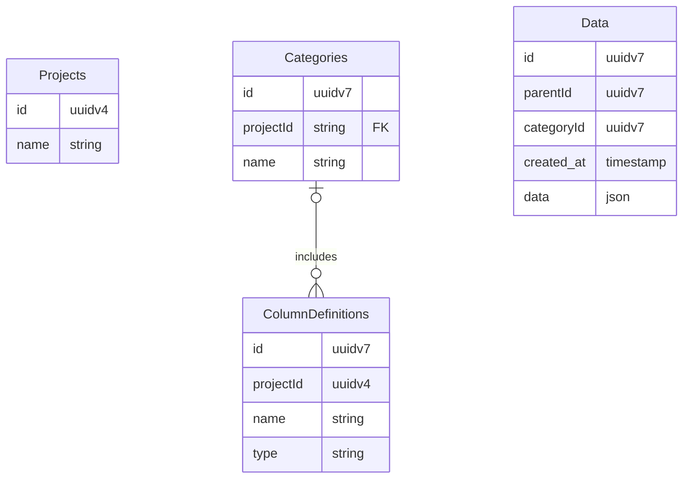
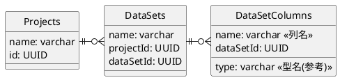

# Lantana DataGarden 開発メモ
枝分かれを含んだ様々なDataを記録するための
Next.js Web アプリケーション
(最初はあくまでポートフォリオ用としたい、
突き詰めればきりがなくなってしまう)

# 各種仕様
開発方針が定まらず色々試してしまうのは、仕様がハッキリ定まっていない
せいが大きいかもしれない......
技術調査の面が大きいので、仕様を決めることで試せることの幅が
狭くなってしまうのはちょっと違う様な気もするのだが...

## このアプリケーションが実現すること
- 汎用的な科学技術Dataの整理、蓄積、分析（準備）
  - Data間のリンクを用いた時系列や条件分岐記録
  - 汎用的なData型を扱える
    - 文字列
      - 選択肢であればComboBoxを表示
    - 数値、有効数字や誤差の扱いを可能にしたい
  - 分析対象Dataを一つの表として出力する（Dataマート化）
- リアルタイムな多人数編集への対応
  - 複数人で編集している場合、変更内容を反映・通知して知らせる
  - 複雑な履歴機能や元に戻す機能はきびしいかも

## 技術選定のカギになりそうな部分
- リアルタイム性を実現するにはクライアントコンポーネントの活用が必要
  - もし全体がクライアントコンポーネントになってしまうなら
    何か考えた方がよい？？
  - 部分的にSSRを利用することを徹底的に考えていたが、
    リアルタイム性が求められる部分は全てCCになるので無駄なあがきかも
## 問題解決のための実装
- Project、Category、Column、Dataに情報を分割する
  - Projectは、複数のCategoryと複数のDataを含む
    - Categoryは、複数のColumnを含む
      - Categoryは、順序、選択肢、測定値の3種類に分かれる
        - 順序CategoryはData表示に用いられる
        - 選択肢CategoryはColumnの内容をユーザが選択式にするため用いる
        - 測定値Categoryは順序Category中のDataに一つor複数の測定値を
          関連付けるために用いる
      - Columnは列の名前とData型を組で記録する
    - DataはColumnに指定された型のJsonDataで記録される
      - Data同士のリンクを表現するためにidを用いる
  - 実装が安定してきたら、ProjectはUser毎に紐づけて管理する

# 汎用性とパフォーマンスの両立を目指して
UI側の技術がかなり向上しそうなので、
より複雑なカスタマイズが可能になりそう

ユーザが自分で項目を設定できるようにしてみたい

## 柔軟な科学Data記録する仕組みの検討
DataSetsの組み合わせ方で、いろんなDataを
表現できそうな点を詰めてみる。

### JSON型を積極的に用いる
パフォーマンスより柔軟性という感覚で進めるならば、
{ "項目1": 値, "項目2": [値2-1, 値2-2], } 的なJSONを使った方が良さそう

(というか、JUMPと連携するという要件が無ければ初めからこの手を考えたかも)

#### ユーザが表の列を定義して、行（Data）を追加できる仕組み検討
もう全部JSONにしちゃうか

### 各種のグループ化について
同じテーブルに属するDataは、その時点で一つのグループとみなせる。

時系列グループ: テーブルに前後関係を与え、それでグループ化

リンク

... グループやリンクなどの概念を組み合わせて、
柔軟なData構造を実現することが出来るのではないだろうか...

- リンクのみではトポロジ的な接続しか表現できない
  （どの位置に表示されたら都合が良いかまでは指定できない）

- Dataがどの位置に表示されるのが都合が良いか表現するために、
  Categoryやグループといった表現方法を使うイメージが良いだろうか？

- 横方向にグループ化するのと、
  縦方向にグループ化するのとありそう

- 今のところ、リンクされた同質なDataを想像してしまっているが
  全く異なる性質のDataをリンクしたり出来るだろうか？

- リンクとCategoryには何かしらお互いを制限する要素が有っても
  不自然ではない（時系列Categoryを遡るリンクは貼れない、とか）

- グループは制限、Categoryは拡張？
  - グループは既存の属性による分割、
  - Categoryは専用の属性による分割？
    元々Category用の分割がされていた場合にどうなるのだろう
  - Categoryは冗長性や曖昧性を許可するのは有りかも？
    どっちが来てもいいよみたいな
    - A -> B -> C という時系列も、 A -> C -> B という時系列も
      試した記録がある場合、B or C というスーパーCategoryを作れると
      画面表示がちょっと見やすいかも。
    - AI分析やDataマート出力を考えた場合にはどっちがよいのだろうか
      - どっちが先だったかフラグが有れば割と良い？

- Dataはparentを持ちうる...というのは、親が一つしかいないDataの
  扱いの場合についてであったが、複数の親がいる場合もあるよね...
  - そうしたらグラフDataベースになるのでは

- 例えば一つのウエハからスタートして、チップに切り分けたものがn個ある
  - ここまでは木構造で表せる
  - 全Dataを記録する際にはいちいちウェハのDataを入力したくないし、
    逆に分析の際には簡単にアクセス出来る様に（JOIN済みの状態に）したい
  - ウエハのDataは"ウエハ"記録に入れる
    ?? これは何？Category？

  - 時系列とかCategoryとかいうより、引き継ぐタイプのData分け？
  - むしろDataに合わせてCategory分けされるぐらいの方が良い？
    (Dataを記録したいのであってCategoryを記録したいのではないので...)

## テンプレート、Category
- 最初にDataを追加する際に
  - Category名を決めます
  - 項目名や型を決めます
    - 項目名や型は、テーブル定義の様なモノです。
      これはCategoryと直接関連付けてしまうと、
      異なるCategoryで同じ項目を使いたい際に不便そうなので、
      項目名や型は、内部では「テンプレート」として持っておきます
  - Dataの入力欄が表形式で作成されます
  - Dataを入力すると表示欄が増え、末尾に入力欄が出来ます

- 項目をグループとして扱ったり、評価Dataを
  別テーブルにする方が都合が良いか、ちゃんと結合できるか？
- テンプレートを結合することが出来たら良さそう
  工程Aで条件グループ1を定義した際に、工程Bでも
  条件グループ1を使いまわしたい、ということはあるかもしれない
  - テンプレートは項目名と型のリストなので、結合や追加はし易そう

- 測定Dataと条件Dataを上手く分けることは出来るか？
- 測定Dataは条件Dataに関連付けられるというイメージ
  - 表としては別に存在しているが、有る条件Dataの測定Dataである、
    ということを表現できないだろうか？
  - relatedId を付けて別のDataと紐づける？
  - 現在はTemplateをCategoryに付け足すことによるData拡張ができる
    - 測定Dataも記録したいときには、測定項目を記録したTemplateを
      Categoryに追加する？
    - 以前は、測定Dataは有るときも無いときもあるし、
      実機との接続に合わせて列の変更を行う際もあるから別にした

    - process_list と evaluation_list を管理し、
      evaluation_list にはどのprocess_idと紐づくのかや、
      測定の種類を記録していて、
      実際の測定Dataは固定のテーブルになっていた。
      今回はユーザが定義したテーブルを参照できるようにしたい。

  - 表示画面の軸になるCategoryと、
    そうでないCategory（一種の非表示、内部Data）が有ってもよいかも
    - 測定Dataの蓄積が内部Dataに存在していて、
      そこから紐づけを行うなど
      - これ、マスタの仕組みと同じでは

- 一旦整理しなおそう...Categoryで表を定義して、
  それをData表示画面の横軸として使用するイメージ
  - これは条件Dataに相当するもの
  - 選択肢マスタや測定結果Dataは大本は別の表にする
    - 具体的には別のCategoryにし、表示画面の軸でないのでメインには
      表示されない感じになる
  - 測定Dataは一時的に隠したり簡易表示（存在するかどうか等）したい
    ドライトマトの例を実現できるか考えてみるか...
  - 測定Dataを追加する際に、どのCategoryを測定Data扱いするか
    選択できるようにするか？
    - 他のDataと区別がつかない同じ形式でも、どう扱うべきか指定すれば
      適切な方式で扱えるかも...
    - Category自体にDataタイプが選択肢、関連Data、等設定出来たら
      よいだろうか
- Webアプリケーションであるという性質上、どうしても何か
  表示するためにはサーバからDataを送ることになる。
  ネイティブで動作するアプリケーションと比べて描画処理も遅いし、
  徹底的に通信量や描画量を削減しつつ、Dataを蓄積できる様にしないと
  - これはビジネスとして生かせる性質かもしれない、
    テスト環境をオンライン上に用意するが、大容量通信を行うのは
    きっとユーザにとっても不便なので、オンプレ？構成とサポートで
    利潤を生むことが出来ないだろうか？
  - Data表示、通信料の削減方法...
    - このアプリケーションはほぼDataの入口、入力フォームとして
      用いられることを想定しているし、実際その様に動作するはず

- Dataの列に追加されるような（1対1対応）Dataと、
  リンクするDataの扱い方を変えるべきだろうか...
  イメージとしてはCategoryのtypeを変える感じだけれども...
  

## Dataベース構造検討
ユーザが自分で項目を設定できるならば、
どうしても「間に一枚かませる」必要がありそう。
具体的には、ユーザが編集できるのはテーブル構造でなく、
どんなDataを記録したいか記録したエントリ、ということになる。

これはData分析においてある程度の複雑性を生むし、
ボトルネックにもなる（テーブルをすんなり出力するより一手以上遅くなる）

早くも詰まった気がする、どうやって色々なData型を受け入れる？
JSON型を使う？にしても適切に扱えるものだろうか...

（現状、なんでも入れられるようにするにはJSONにするしかなさそう）

DataSetsにDataSetsを関連付けたり、入れ子にしたり出来たら
表現力がアップするだろうか？

例えば「ドライトマトのレシピ」Projectにおいて、
「オーブン」というDataSetsがあり、
「温度プロファイル」というDataSetColumnsが定義されているとする

「温度プロファイル」DataSetColumnsは単一Dataでなく、
時間と温度の2項目からなる配列Dataである

みたいなことを実現したいものだが...

一回「なんでも入るData型」について扱いをちゃんと考えた方がよさそう

