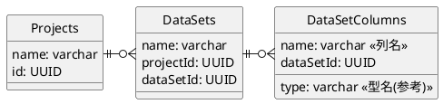

# Lantana DataGarden 開発メモ
枝分かれを含んだ様々なデータを記録するための
Next.js Web アプリケーション
(最初はあくまでポートフォリオ用としたい、
突き詰めればきりがなくなってしまう)

# 汎用性とパフォーマンスの両立を目指して
UI側の技術がかなり向上しそうなので、
より複雑なカスタマイズが可能になりそう

ユーザが自分で項目を設定できるようにしてみたい

## データベース構造検討
ユーザが自分で項目を設定できるならば、
どうしても「間に一枚かませる」必要がありそう。
具体的には、ユーザが編集できるのはテーブル構造でなく、
どんなデータを記録したいか記録したエントリ、ということになる。

これはデータ分析においてある程度の複雑性を生むし、
ボトルネックにもなる（テーブルをすんなり出力するより一手以上遅くなる）

早くも詰まった気がする、どうやって色々なデータ型を受け入れる？
JSON型を使う？にしても適切に扱えるものだろうか...

（現状、なんでも入れられるようにするにはJSONにするしかなさそう）

DataSetsにDataSetsを関連付けたり、入れ子にしたり出来たら
表現力がアップするだろうか？

例えば「ドライトマトのレシピ」Projectにおいて、
「オーブン」というDataSetsがあり、
「温度プロファイル」というDataSetColumnsが定義されているとする

「温度プロファイル」DataSetColumnsは単一データでなく、
時間と温度の2項目からなる配列データである

みたいなことを実現したいものだが...

一回「なんでも入るデータ型」について扱いをちゃんと考えた方がよさそう

## 柔軟な科学データ記録する仕組みの検討
DataSetsの組み合わせ方で、いろんなデータを
表現できそうな点を詰めてみる。

### JSON型を積極的に用いる
パフォーマンスより柔軟性という感覚で進めるならば、
{ "項目1": 値, "項目2": [値2-1, 値2-2], } 的なJSONを使った方が良さそう

(というか、JUMPと連携するという要件が無ければ初めからこの手を考えたかも)

#### ユーザが表の列を定義して、行（データ）を追加できる仕組み検討
もう全部JSONにしちゃうか

