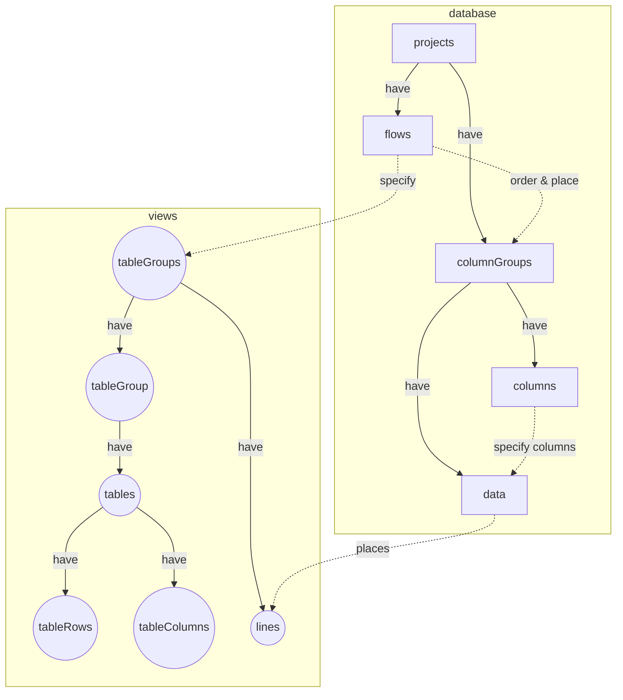
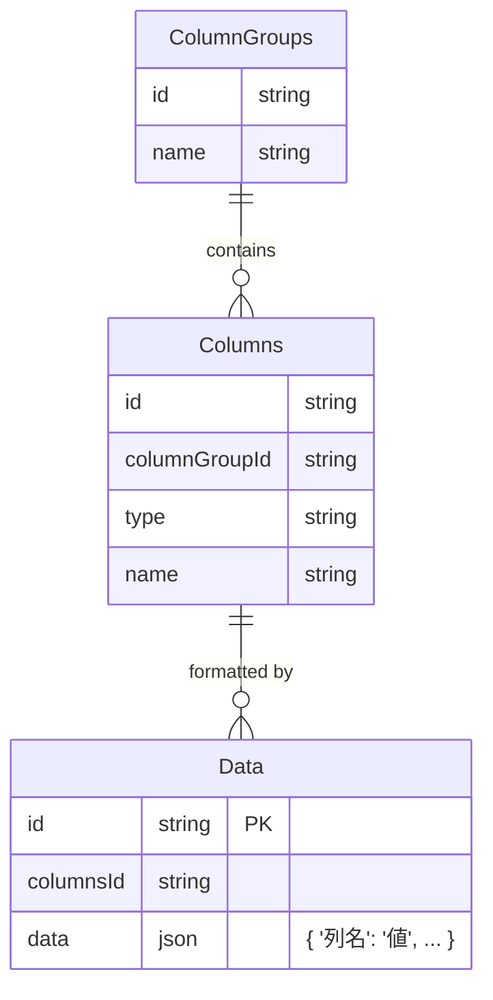
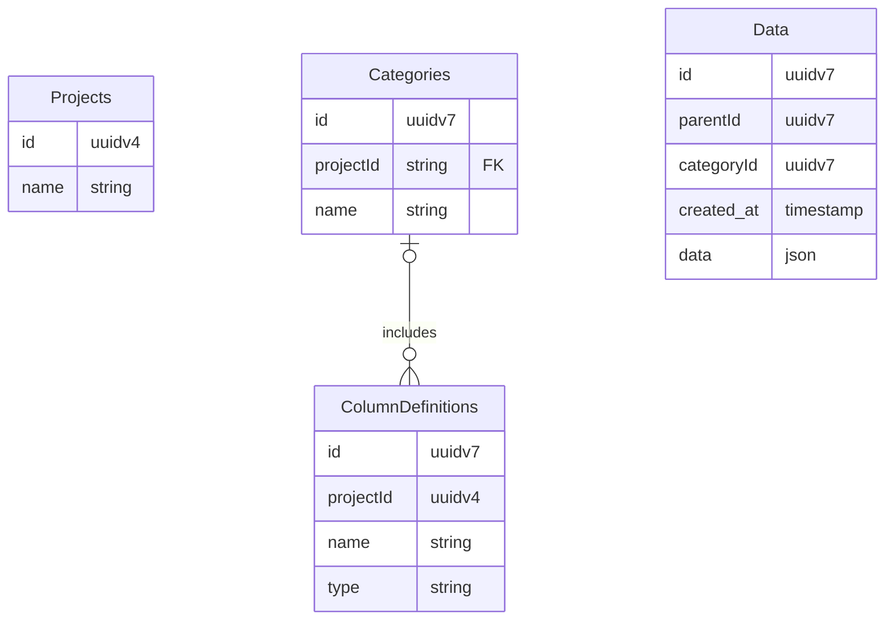
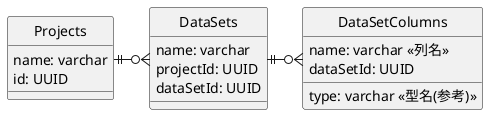

# Lantana DataGarden 開発メモ
枝分かれを含んだ様々なDataを記録するための
Next.js Web アプリケーション
(最初はあくまでポートフォリオ用としたい、
突き詰めればきりがなくなってしまう)

# 各種仕様
開発方針が定まらず色々試してしまうのは、仕様がハッキリ定まっていない
せいが大きいかもしれない......
技術調査の面が大きいので、仕様を決めることで試せることの幅が
狭くなってしまうのはちょっと違う様な気もするのだが...

## このアプリケーションが実現すること
- 汎用的な科学技術Dataの整理、蓄積、分析（準備）
  - Data間のリンクを用いた時系列や条件分岐記録
  - 汎用的なData型を扱える
    - 文字列
      - 選択肢であればComboBoxを表示
    - 数値、有効数字や誤差の扱いを可能にしたい
  - 分析対象Dataを一つの表として出力する（Dataマート化）
- リアルタイムな多人数編集への対応
  - 複数人で編集している場合、変更内容を反映・通知して知らせる
  - 複雑な履歴機能や元に戻す機能はきびしいかも

## オプショナルな値に対応させる
Column設定で、空欄を認めるか設定出来る様にする

isOptionalフラグを用意し、trueであればundefinedが入るのを許容する

isOptional == falseであれば、その欄が空でない値で埋まるまで
書き込みさせない様にしたい

validate 関数を拡張する必要がありそう

2025/04/12 一旦データベース側にisOptionalフィールドを増やした
細かなロジック実装はこれからだが、これによりundefinedとnullを
区別して扱い、新規追加データが - で表示されるバグも防げた。

## 測定データを扱えるようにする
測定データは、
- 一つの条件データに複数紐づけ可能なcolumnGroup
- あるデータに紐づけられた測定データの表示方法は複数通りから選べる
  - 有無をチェックマークで表示
  - 全て並べて表示
  - 平均や誤差など統計量を1行で表示

- 測定データも一見columnGroupであるが、どう区別するべきか？
  - 別テーブル？
    - バックアップや外部アプリケーションからの追加、
      データ量が全く異なる等の場合には別テーブルの方がよい

MeasurementDataテーブルを作る
MeasurementColumnGroupとMeasurementColumnGroupも作るべき？
それは流石に必要ないか...区別はしっかり出来る様にしたい

どうやってColumnGroupと紐付けるか
- ColumnGroup設定画面で、どの測定データを使用しうるか、
  どうやって表示するかを選択させる

どうやってDataと紐付けるか？
- data.id と measurementData.dataId が同じものを紐づける

どうやって取得するか？
- ネストしたオブジェクトとして取得？
  - 測定AとBの2種類のデータが1つずつある場合、どう処理されるか？
    - measurements: {
        A: MeasurementData[],
        B: MeasurementData[]
      }
    - この場合統計処理はクライアント側になるのか？
      サーバ側で完結させたい
      - MeasurementData | Statistics | 
        といった感じ？ 

どうやって追加するか？
- 特定のMeasurementだけ表示する画面で、一意な名前でデータ追加？
  その名前を後からしていする？
- UI的には、内容非表示ならばモーダルで、
  一覧表示されていれば直接入力でいくか

WRITING...

以前のメモ

## MergedTable と Grouping の処理...
ListedTable では、columnGroupWithGroupings に対して
それぞれに Grouping を設定する

だが、MergedTable では複数の異なる複数のcolumnGroupを
仮想的に一つとして扱うので、指定先が難しい

- 仮にマージした全てのcolumnGroupWithGroupingsを一括で更新すると...
  - 存在しない列がgroupingに指定された際の挙動を確認する必要あり
  - 大丈夫そうなので採用
- useState\<Grouping\>()をする手もあるが、それでは表示方法を
  共有、保存できない

## Flow, FlowStep, ColumnGroup の処理について...
同じColumnGroupを、同じFlow内で何度も使用するのは意味が無い
（ただの重複になる）ので、これを防止したい

クライアント側で素朴にこれを実現する方法をChatGPTに聞いてみたが、
FlowStep間では重複が無いのだが、FlowStep内では重複してしまう......

ちょっと真面目に考えたい

- 同じColumnGroupは1度のみFlow内に指定できるようにしたい
  - これ、異なる使用方法はあり得ないだろうか？
    例えば複数回同じ種類の工程を経る必要があるデータについて、
    1回目も2回目も同じ工程だから同じColumnGroupに入れるという使い方は
    あり得るのではないだろうか？
  - 現在のデータ取得方法はどうなっていたっけ......
    上記の様な使い方をする場合、親子関係を絞って取得しないと
    データが重複する（工程に含まれるデータがすべて表示されてしまう）
    - Flowに含まれるColumnGroupに属するデータを全て取得している
      つまり、2025/04/08現在のコードではこの使い方はできない

## Grouping の更新処理の書き方
GroupingはFlow -> FlowStep -> ColumnGroupWithGrouping -> Grouping
に記録されており、これを更新するには flow の update を呼ぶ必要がある

UI的には Tables -> FlowStep -> Listed/MergedTable -> TableGroup
となっており、ちょっと遠い.....

いっそ一発で Flow 中の columnGroup を指定する方法が有ればよいのだが

- Tables は Flow に対応する
  - update はここにあり、データベース側にテーブルを持たず
    JSON型で記録されるFlowStepは全体を一括でupdateするしかない...
- FlowStep は UI 上の FlowStep に対応
  - 特定の FlowStep のみの更新を担当するべき
  - Listed/MergedTableへの橋渡しもここで行われる

  - flowStep.columnGroups が、Listed/MergedTableに渡される
## データ表示方法の整理
- データを表示する方法の制御についてまとめる
- 他ユーザと表示方法を共有する方法も考える

- データベースに実体があるデータ構造と、表示するための仮想的なデータ構造がある
  - projects, flows 等はデータベースに実体がある
  - tables は無い、データベースの「影」、もっと言えば純粋関数による射影
- 表示する側の階層構造(tableGroups, tableGroup, tables) に合わせて
  データベース側のデータ構造を配置すると分かりやすくなるかも

data と flows が独立しているために柔軟な表示方法を取れるが、
それゆえにlinesを引くのにdataを取ってくる部分が浮いている感じの
現在の実装の問題点を明らかにしてくれている気がする。

## どうやってtableのグループ化を行うか
単一のcolumnGroup in Step in Flowを、親や列の値でグループ化して
表示したいのだが...

columnGroup in step in flow は number[][] で表現されているので...

グループ化に関する情報を記録しづらいというか...

- 単純なidでなく、グループ化方法も記録できるオブジェクトとする?
  - ColumnGroupWithGroupingMethod: { id: number, grouping: string }
  - 2025/04/08 現在、groupingをより詳細な情報を記述できるオブジェクト
    としてこの案を採用している
## バックエンドの階層分け
tRPCのルート、プロシージャを、現在のデータベース構造よりのものから
アプリケーション寄りに変えたい。

flows であれば flows ページで使用する機能を列挙し、
tables であれば tables ページで使用する機能を列挙するイメージ。

## データ間を線で結ぶ方法について
データが追加された際に線を書き直すのが意外と難しい

RealtimeTables内で線を引いているが、
データの追加は各RealtimeTable内で処理が行われるため、
検出するのがちょっと難しい

いっそConnectorsProviderなどコンテキストにして、
子コンポーネントのどこからでもupdateLinesを呼べるようにするべきか

だが現状はRealtimeTable内のonUpdateListを検出できれば良いので、
propsで渡してしまうか...

### 親子関係のあるデータの扱い再考
`trpc.table.get` 中では先にcolumn関連の情報を取得している。
それに合わせてデータを取得している感じ
- columnGroupを取得する
- そこに含まれるinnerColumnGroupを取得する
- (そこに含まれるcolumnsを取得する)
- 関連するデータを取得する

これはデータの親子関係と列がケンカしそう...
どっちが上位概念？

- 列が上位で親子関係が下位なら...
  - データの表示場所は列で決まる
  - 親子関係が列と矛盾する場合には、表示ロジックを工夫する
- 親子関係が上位で列が下位なら...
  - データの表示場所は親子関係で決まる
  - 複数の列（グループ）が同じレベルにある場合、表示ロジックを工夫する

列やそのグループを定義してからの方がやり易そう...
1. 最初の列・列グループ通りにデータを取得、表示
2. 次の列・列グループは親の順や、カテゴリの順でデータを表示
3. 間を線でつなぐ
4. 2-3 の繰り返し 

### 列定義が最初、親子関係は後
初心に帰って列中心の構造を作ってみよう

1対多対応するデータは別テーブルに分けるので、
自然とcolumnGroups周りの定義が単純化される（innerColumnGroupはなし）

serverの関数を整理していたら分からなくなったことが...
tableはトップレベルでネストしたオブジェクトを返し、
子コンポーネントで初期値として用いて高速なレンダリングを行っている

これをcolumnGroupでやろうとすると何か変、
updateイベントがネストされた型と合わない

tableはDBに直接対応しないのでUpdateがない

columnGroupやcolumnは実体があるので、ネストしたオブジェクトの
取得用ルートを、ネストしていない素朴なデータ取得結果で
アップデートできない?

- columnGroupsコンポーネントでネストしたデータを取得
  ここは明示的な再読み込みが無い限りアップデートしない
  - NO, columnGroupの数が変わった際にはイベント取得しないと
  - 実際の表示はcolumnGroupコンポーネントで行う
    ここはcolumnGroupsからpropsで貰ったデータをキャッシュする
    必要に応じてそれをキャッシュ、更新

## パフォーマンスより汎用性と表現力を優先したらどうなるか...
Excelで整理するより効率的にするには色々な方法があるが、
リレーションを上手く使うことが一つの解決方法になる気がする。

突き詰めて考えれば、全ユーザがリレーションを使いこなせれば、
（RDBにおけるデータベースの正規化を正しく行うことが出来ればくらいの意）
かなり効率的な科学技術データの整理が可能になるのでは

### リレーショナルを活用しやすい汎用的なデータベースとは?
最初から柔軟性を重視するのであれば、全ての列を別々のテーブルに分ける
（実際にそうする訳ではなく、データ構造のイメージ）のが良い気がする

### データ読み込み方法について
表のコンポーネントを順次レンダリングしながら
データを逐次読み込みしていくのは様々な問題が有りそうなので、
tableルートをtRPCに作って、db.queryを用いて一気にデータ取得を行う

（全データを表示すると通信量が膨大になりうるので、
徹底してデータを部分的に表示する姿勢は保つ）

そうすれば、最初の一括データ取得さえ適切に出来れば
表を一気にレンダリングし、操作することが可能になるはず...

### 親子関係と列の関係について
親子関係と列は必ずしも単純に対応しないのでは
2列目を飛ばして3列目の子要素を追加する様な場合はあるだろうか...

最初にイメージしていた、親子関係はトポロジを定義するのみで、
列名が表示場所を決めるという考えはまだ生かせるだろうか？

- `column.name` や `columnGroupId` が 現在表示処理中のものと異なっていたら、
  そのデータはより後の列に属するとして後回しにする、とか？

### 改めてこれは何をするデータベースなのか考察
現在のUIでは、複数の複数項目列があった際に、
その任意の一つを1対多対応データにする仕組みが無い。

（ボタンを付ければ良いじゃないか説はある）

また、データの親子関係と列の関係を上手く扱えていない
データに親子関係が有れば、列の扱いについても何か変わる気がするが、
現状何も考慮していない。

（`columnGroup`, `innerColumnGroup` の分け方とdataの親子関係に
関係がありそう）

### 全体読み込み、部分更新の仕組みを再検討
素朴な実装では上手くいかないケースがある。
個別の変更はDebouncedInputで直接DBへ書き込んでいたが、
これはキャッシュを更新しない。

- テーブル全体のデータ取得とそのキャッシュ
  - 最初のデータのキャッシュとsubscription
    - 子データのキャッシュとsubscription

子データのキャッシュは最初のデータだけ全体から取得して、
変更がある場合には自分だけ更新する仕組みを作ってみたい

親要素の持つただ一つのキャッシュを適切に更新する手法の方が
素直かもしれない

→ これを更新すると全体の再描画が行われるのは避けられなそう

### 1対多データを工夫して表示する
ExcelやRDBにおける難しい部分の一つは、1対多のデータをどうやって
表示するか、編集するか
（1セルに多数のデータを入れようとすると大抵上手くいかないし、
 RDBでもこれを汎用的に行えるものはあまりなさそう）

 1列毎に別テーブル扱いしているならば行数を揃える必要は無いので、
 1対多対応のデータも簡単に記録できるし、
 画面上でどのように表示するか
 - テーブル結合して多数の行を表示するか
 - 統計値だけ表示するか
 - 簡易グラフを表示するか
 
など選択することができそう
ただ、毎回ものすごい回数のループ回すことにならないか？
確実に1対1対応する部分が分かっているならば、
それはその様に扱った方が良いのではないだろうか

- 1対1対応するデータはJSON型で保存
- 1対多対応するデータは異なるカテゴリとして切り出し

という変換動作をスムーズに実行できるようにしたいところ

### 参照（RDBにおける外部キー）をどう表現するか
1列ずつ別扱いになっているデータは、1列ずつ、もしくは1対1対応する
他の関連する列と一緒に取り出して表示、編集、参照したい。

その際、どの列を、何のデータをキーとして抽出するか定める仕組みと、
外部参照を使用するフラグを用意すれば、実現できるだろうか？

......何だかRDBのGUIを作っている気分.....

### UIについてメモ
stickyはスクロールする要素内でしか動作せず、
素朴にbody要素が中身に合わせて大きさが変わってて、
ブラウザ自体にスクロールさせる方法では働かない

### データ構造について

### データ構造とデータ入力の関連
- ColumnsはDataのJSON型の列名やデータ型を記録する
- ColumnGroupsは、1対1対応するColumnの列の組を記録する
- DisplayColumnGroupsは、1対1対応とは異なる尺度のユーザフレンドリーな列の組を記録する
- DataはJSON型で1対1対応するデータの組を保持する
  

#### 操作例
- ユーザが最初に列名を追加する
  - **列グループ名**
    |サンプル名|
    |----|
    ||
  - DisplayColumnGroups: { name: "列グループ名" }
  - ColumnGroups: { id: 0, displayColumnGroupId: 0 }
  - Columns: { groupId: 0, name: サンプル名, type: string }
- ユーザがデータを入力する
  - **列グループ名**
    |サンプル名|
    |----|
    |A|
  - DisplayColumnGroups: { name: "列グループ名" }
  - ColumnGroups: { id: 0, displayColumnGroupId: 0 }
  - Columns: サンプル名, string
  - Data : { "サンプル名": "A" }
- ユーザが列を追加し、データも追加する
  - **列グループ名**
    |サンプル名|条件名|
    |---|---|
    |A|J1|
  - DisplayColumnGroups: { name: "列グループ名" }
  - ColumnGroups: { id: 0, displayColumnGroupId: 0 }
  - Columns: { groupId: 0, name: サンプル名, type: string }, { groupId: 0, name: 条件名, type: string }
  - Data: { "サンプル名": "A", "条件名": "J1" }
- ユーザがデータを追加し、1対多対応の部分ができる
  - **列グループ名**
    |サンプル名|条件名|
    |---|---|
    |A|J1|
    ||J2|
  - DisplayColumnGroups: { id: 0, name: "列グループ名" }
  - ColumnGroups: 
    - { id: 0, displayColumnGroupId: 0 }, 
    - { id: 1: displayColumnGroupId: 0 },
  - Columns: 
    - { id: 0, groupId: 0, name: サンプル名, type: string }, 
    - { id: 1, groupId: 1, name: 条件名, type: string }
  - Data: 
    - { id: 0, columnId: 0, data: {'サンプル名': 'A'}}, 
    - { id: 1, columnId: 1, data: {'条件名': 'J1'}}

- ユーザが1対1対応の列を追加する
  - **列グループ名**
    |サンプル名|条件名|条件データ|
    |---|---|---|
    |A|J1|d1|
    ||J2|d2|
  - DisplayColumnGroups: { id: 0, name: "列グループ名" }
  - ColumnGroups: 
    - { id: 0, displayColumnGroupId: 0 }, 
    - { id: 1: displayColumnGroupId: 0 },
  - Columns: 
    - { id: 0, groupId: 0, name: サンプル名, type: string }, 
    - { id: 1, groupId: 1, name: 条件名, type: string }
    - { id: 2, groupId: 1, name: 条件データ, type: string },
  - Data: 
    - { id: 0, columnId: 0, data: {'サンプル名': 'A'}}, 
    - { id: 1, columnId: 1, data: {'条件名': 'J1', '条件データ': 'd1'}}
    - { id: 2, columnId: 1, data: {'条件名': 'J2', '条件データ': 'd2'}}

問題はUIか...
- 列の追加はセルからではなく列名部分から行う
- データの追加は...？
  - セルの下に+マークを出す？

API構成（tRPCのルータ構成）をどうするか悩む、
innerColumnsは見えない形方が良いのではないだろうか？

列構成の取得とデータの取得と、どんな風に行うべきだろうか？

表部分は全てのデータについてはリアルタイム更新を行うつもりは無く、
変更が通知できれば良いと考えているが....

- 案1、一挙に取得
  - columnGroupsから関連するcolumnsまでネストして取得してしまう
  - dataを適宜joinして取得する方法を、先ほどの列情報取得から行えるはず
  - 全てjoin済みのデータとcolumnGroupsの情報を合わせてクライアントに返す
  - 一挙にその情報を表示
  - データ更新は適宜サーバに送信するが、他の人の更新の取得はなし

- 案2、順次取得
  - columnGroups関連の情報は一挙に取得するとして......
  - dataは順次ロードする、N+1問題上等...とは言わないが...

目的のデータをロードするにはinnerColumnGroupのIdが必要で、
これを取得するにはcolumnGroupIdが必要
columnGroupを取得するにはprojectIdが必要

1対多対応するデータをjoinで読み込めるように工夫しているつもりだが、
本当に上手くいくだろうか...

columnGroup→innerColumnGroup→Dataの順で読み込むイメージだろうか

## 技術選定のカギになりそうな部分
- リアルタイム性を実現するにはクライアントコンポーネントの活用が必要
  - もし全体がクライアントコンポーネントになってしまうなら
    何か考えた方がよい？？
  - 部分的にSSRを利用することを徹底的に考えていたが、
    リアルタイム性が求められる部分は全てCCになるので無駄なあがきかも

## 問題解決のための実装
- Project、Category、Column、Dataに情報を分割する
  - Projectは、複数のCategoryと複数のDataを含む
    - Categoryは、複数のColumnを含む
      - Categoryは、順序、選択肢、測定値の3種類に分かれる
        - 順序CategoryはData表示に用いられる
        - 選択肢CategoryはColumnの内容をユーザが選択式にするため用いる
        - 測定値Categoryは順序Category中のDataに一つor複数の測定値を
          関連付けるために用いる
      - Columnは列の名前とData型を組で記録する
    - DataはColumnに指定された型のJsonDataで記録される
      - Data同士のリンクを表現するためにidを用いる
  - 実装が安定してきたら、ProjectはUser毎に紐づけて管理する

## データの関連性の種類と、表現方法
- 親子関係、条件分岐
  - sequenceタイプのCategoryが2つ以上定義されていたら、
    親データより後ろのsequenceに属する子データを追加できる
  - 親子関係はDataのidで表現する
    - 以前はprev\_id列を持たせていたが、別テーブルでも良いかも
      親が複数の場合さえ表現できるかもしれない
  - sequenceタイプのCategoryは画面上で横並びで表示される
    間はある程度の幅を持つ空白の要素を入れておき、
    関連する要素同士を線でつなぐ
- 条件と測定結果
  - columnのタイプをmeasurementにした場合、
    指定されたidのmeasurement Categoryからデータを参照できる
  - sequenceタイプのCategoryの列（条件）に対して右側にくっついて
    （RowGroupとして）表示される
  - 簡易表示されている際にはデータの有無のみを表示し、
    展開した際にはデータも表示する
  - 

うーん、そんなことより入れ子構造、例えば配列型データの
扱いを考えた方が一般的なデータの扱いが上手く出来そう。

条件だって配列データ（温度上昇プロファイルとか）かもしれない

データの中にデータを入れる仕組みがあると良い気がする

カテゴリ：温度プロファイル
プロファイル名、

# 汎用性とパフォーマンスの両立を目指して
UI側の技術がかなり向上しそうなので、
より複雑なカスタマイズが可能になりそう

ユーザが自分で項目を設定できるようにしてみたい

## 柔軟な科学Data記録する仕組みの検討
DataSetsの組み合わせ方で、いろんなDataを
表現できそうな点を詰めてみる。

### JSON型を積極的に用いる
パフォーマンスより柔軟性という感覚で進めるならば、
{ "項目1": 値, "項目2": [値2-1, 値2-2], } 的なJSONを使った方が良さそう

(というか、JUMPと連携するという要件が無ければ初めからこの手を考えたかも)

#### ユーザが表の列を定義して、行（Data）を追加できる仕組み検討
もう全部JSONにしちゃうか

### 各種のグループ化について
同じテーブルに属するDataは、その時点で一つのグループとみなせる。

時系列グループ: テーブルに前後関係を与え、それでグループ化

リンク

... グループやリンクなどの概念を組み合わせて、
柔軟なData構造を実現することが出来るのではないだろうか...

- リンクのみではトポロジ的な接続しか表現できない
  （どの位置に表示されたら都合が良いかまでは指定できない）

- Dataがどの位置に表示されるのが都合が良いか表現するために、
  Categoryやグループといった表現方法を使うイメージが良いだろうか？

- 横方向にグループ化するのと、
  縦方向にグループ化するのとありそう

- 今のところ、リンクされた同質なDataを想像してしまっているが
  全く異なる性質のDataをリンクしたり出来るだろうか？

- リンクとCategoryには何かしらお互いを制限する要素が有っても
  不自然ではない（時系列Categoryを遡るリンクは貼れない、とか）

- グループは制限、Categoryは拡張？
  - グループは既存の属性による分割、
  - Categoryは専用の属性による分割？
    元々Category用の分割がされていた場合にどうなるのだろう
  - Categoryは冗長性や曖昧性を許可するのは有りかも？
    どっちが来てもいいよみたいな
    - A -> B -> C という時系列も、 A -> C -> B という時系列も
      試した記録がある場合、B or C というスーパーCategoryを作れると
      画面表示がちょっと見やすいかも。
    - AI分析やDataマート出力を考えた場合にはどっちがよいのだろうか
      - どっちが先だったかフラグが有れば割と良い？

- Dataはparentを持ちうる...というのは、親が一つしかいないDataの
  扱いの場合についてであったが、複数の親がいる場合もあるよね...
  - そうしたらグラフDataベースになるのでは

- 例えば一つのウエハからスタートして、チップに切り分けたものがn個ある
  - ここまでは木構造で表せる
  - 全Dataを記録する際にはいちいちウェハのDataを入力したくないし、
    逆に分析の際には簡単にアクセス出来る様に（JOIN済みの状態に）したい
  - ウエハのDataは"ウエハ"記録に入れる
    ?? これは何？Category？

  - 時系列とかCategoryとかいうより、引き継ぐタイプのData分け？
  - むしろDataに合わせてCategory分けされるぐらいの方が良い？
    (Dataを記録したいのであってCategoryを記録したいのではないので...)

## テンプレート、Category
- 最初にDataを追加する際に
  - Category名を決めます
  - 項目名や型を決めます
    - 項目名や型は、テーブル定義の様なモノです。
      これはCategoryと直接関連付けてしまうと、
      異なるCategoryで同じ項目を使いたい際に不便そうなので、
      項目名や型は、内部では「テンプレート」として持っておきます
  - Dataの入力欄が表形式で作成されます
  - Dataを入力すると表示欄が増え、末尾に入力欄が出来ます

- 項目をグループとして扱ったり、評価Dataを
  別テーブルにする方が都合が良いか、ちゃんと結合できるか？
- テンプレートを結合することが出来たら良さそう
  工程Aで条件グループ1を定義した際に、工程Bでも
  条件グループ1を使いまわしたい、ということはあるかもしれない
  - テンプレートは項目名と型のリストなので、結合や追加はし易そう

- 測定Dataと条件Dataを上手く分けることは出来るか？
- 測定Dataは条件Dataに関連付けられるというイメージ
  - 表としては別に存在しているが、有る条件Dataの測定Dataである、
    ということを表現できないだろうか？
  - relatedId を付けて別のDataと紐づける？
  - 現在はTemplateをCategoryに付け足すことによるData拡張ができる
    - 測定Dataも記録したいときには、測定項目を記録したTemplateを
      Categoryに追加する？
    - 以前は、測定Dataは有るときも無いときもあるし、
      実機との接続に合わせて列の変更を行う際もあるから別にした

    - process_list と evaluation_list を管理し、
      evaluation_list にはどのprocess_idと紐づくのかや、
      測定の種類を記録していて、
      実際の測定Dataは固定のテーブルになっていた。
      今回はユーザが定義したテーブルを参照できるようにしたい。

  - 表示画面の軸になるCategoryと、
    そうでないCategory（一種の非表示、内部Data）が有ってもよいかも
    - 測定Dataの蓄積が内部Dataに存在していて、
      そこから紐づけを行うなど
      - これ、マスタの仕組みと同じでは

- 一旦整理しなおそう...Categoryで表を定義して、
  それをData表示画面の横軸として使用するイメージ
  - これは条件Dataに相当するもの
  - 選択肢マスタや測定結果Dataは大本は別の表にする
    - 具体的には別のCategoryにし、表示画面の軸でないのでメインには
      表示されない感じになる
  - 測定Dataは一時的に隠したり簡易表示（存在するかどうか等）したい
    ドライトマトの例を実現できるか考えてみるか...
  - 測定Dataを追加する際に、どのCategoryを測定Data扱いするか
    選択できるようにするか？
    - 他のDataと区別がつかない同じ形式でも、どう扱うべきか指定すれば
      適切な方式で扱えるかも...
    - Category自体にDataタイプが選択肢、関連Data、等設定出来たら
      よいだろうか
- Webアプリケーションであるという性質上、どうしても何か
  表示するためにはサーバからDataを送ることになる。
  ネイティブで動作するアプリケーションと比べて描画処理も遅いし、
  徹底的に通信量や描画量を削減しつつ、Dataを蓄積できる様にしないと
  - これはビジネスとして生かせる性質かもしれない、
    テスト環境をオンライン上に用意するが、大容量通信を行うのは
    きっとユーザにとっても不便なので、オンプレ？構成とサポートで
    利潤を生むことが出来ないだろうか？
  - Data表示、通信料の削減方法...
    - このアプリケーションはほぼDataの入口、入力フォームとして
      用いられることを想定しているし、実際その様に動作するはず

- Dataの列に追加されるような（1対1対応）Dataと、
  リンクするDataの扱い方を変えるべきだろうか...
  イメージとしてはCategoryのtypeを変える感じだけれども...
  

## Dataベース構造検討
ユーザが自分で項目を設定できるならば、
どうしても「間に一枚かませる」必要がありそう。
具体的には、ユーザが編集できるのはテーブル構造でなく、
どんなDataを記録したいか記録したエントリ、ということになる。

これはData分析においてある程度の複雑性を生むし、
ボトルネックにもなる（テーブルをすんなり出力するより一手以上遅くなる）

早くも詰まった気がする、どうやって色々なData型を受け入れる？
JSON型を使う？にしても適切に扱えるものだろうか...

（現状、なんでも入れられるようにするにはJSONにするしかなさそう）

DataSetsにDataSetsを関連付けたり、入れ子にしたり出来たら
表現力がアップするだろうか？

例えば「ドライトマトのレシピ」Projectにおいて、
「オーブン」というDataSetsがあり、
「温度プロファイル」というDataSetColumnsが定義されているとする

「温度プロファイル」DataSetColumnsは単一Dataでなく、
時間と温度の2項目からなる配列Dataである

みたいなことを実現したいものだが...

一回「なんでも入るData型」について扱いをちゃんと考えた方がよさそう

